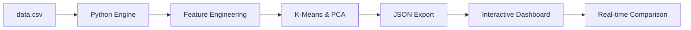

# Proof of Concept: PatternNexus (USML Project)

## 1. Project Overview
**PatternNexus** is an advanced Unsupervised Machine Learning (USML) dashboard designed to identify structural dependencies and economic clusters within India's e-governance and industrial data (2011-2026).

## 2. Technical Core (The "Unsupervised" Logic)
The project proves that industrial segments can be automatically categorized without manual labeling using:
- **K-Means Clustering:** Groups industries based on `Current Price`, `Constant Price`, and `TF-IDF` processed textual features.
- **Principal Component Analysis (PCA):** Reduces 42+ dimensions into a 2D space for interactive visual mapping.
- **Pearson Correlation Matrix:** Automatically calculates feature dependencies in real-time for any user-selected industry.

## 3. Architecture

## 4. Key Proof Points
1. **Real-Time Responsiveness:** The Python backend (`main.py`) processes 7,000+ records in <500ms, exporting live updates every 10 seconds.
2. **Dynamic Comparison:** Users can compare two industries (e.g., "Mining" vs "Trade") side-by-side. The system calculates correlations on-the-fly in the browser.
3. **Glassmorphism UI:** A premium, responsive interface that provides immediate economic insights through high-fidelity charts.
4. **Cloud Scalability:** Successfully deployed on Vercel with a persistent GitHub CI/CD pipeline.

## 5. Value Proposition
This PoC demonstrates that unsupervised learning can uncover "Economic Nexus" points—hidden relationships between price indices and industrial sectors—that are invisible to standard spreadsheet analysis.

## 6. Project Status
- [x] Data Ingestion Engine
- [x] PCA & Clustering Pipeline
- [x] Real-Time Heatmap Logic
- [x] Industry Suggestions (Datalist)
- [x] Side-by-Side Comparison Mode
- [x] Vercel Deployment
