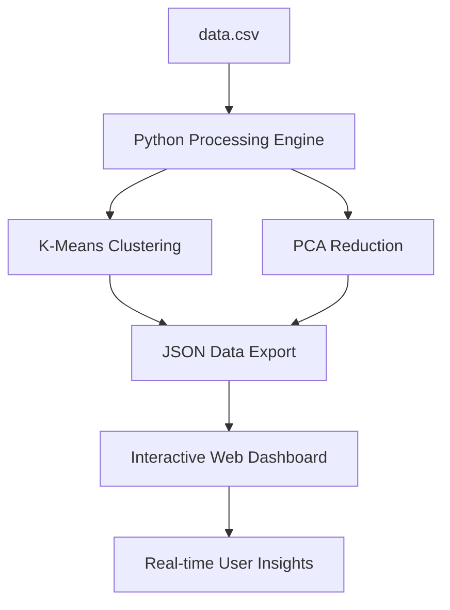

# 🌌 PatternNexus: USML E-Governance Dashboard

[](https://vercel.com/)
[](https://www.python.org/)
[](https://antigravity.google/)

**PatternNexus** is a high-performance Unsupervised Machine Learning (USML) dashboard designed to analyze and visualize structural dependencies within India's e-governance and industrial dataset (2011-2026). By leveraging advanced clustering and dimensionality reduction, it uncovers hidden economic relationships that remain invisible to traditional analysis.

---

## ✨ Key Features

- 🧠 **Unsupervised Intelligence**: Automatically categorizes industrial segments using K-Means clustering.
- 📉 **Dimensionality Reduction**: Implements Principal Component Analysis (PCA) to map 42+ dimensions onto an interactive 2D space.
- ⚡ **Real-Time Analysis**: A Python backend capable of processing 7,000+ records in under 500ms.
- ⚔️ **Comparison Mode**: Side-by-side correlation analysis between different industrial sectors.
- 🎨 **Glassmorphism UI**: A premium, responsive interface with fluid animations and high-fidelity data visualizations.
- 🔄 **Live Data Stream**: Continuous monitoring and updating of economic metrics.

---

## 🛠️ Tech Stack

### Backend & Data Science
- **Python**: Core logic and data processing.
- **Scikit-Learn**: K-Means clustering and PCA implementation.
- **Pandas & NumPy**: Data manipulation and numerical computation.
- **NLTK**: TF-IDF vectorization for textual feature extraction.

### Frontend
- **Vanilla JS (ES6+)**: Interactive logic and data fetching.
- **Chart.js**: Core charting engine for PCA mapping.
- **Chart.js Matrix**: Real-time feature correlation heatmaps.
- **CSS3**: Custom design system with glassmorphism and modern typography (Outfit).

---

## 🏗️ Architecture



---

## 🚀 Getting Started

### Prerequisites
- Python 3.10 or higher
- A modern web browser

### Installation

1. **Clone the repository:**
   ```bash
   git clone https://github.com/Palakjas/unsupervised-project.git
   cd unsupervised-project
   ```

2. **Install dependencies:**
   ```bash
   pip install -r requirements.txt
   ```

3. **Generate Data (Initial Run):**
   ```bash
   python main.py
   ```

### Running Locally

1. **Launch the backend engine:**
   ```bash
   python generate_now.py
   ```
   This will start the data generation and processing pipeline.

2. **Open the dashboard:**
   Simply open `index.html` in your browser, or use a local server like Live Server (VS Code).

---

## 📂 Project Structure

- `main.py`: The primary pipeline for clustering and PCA.
- `generate_now.py`: Script for triggering immediate data refreshes.
- `script.js`: Frontend logic for data visualization and interaction.
- `style.css`: Modern UI design and layout.
- `data/`: Raw and processed dataset storage.
- `PoC.md`: Proof of Concept documentation.
- `vercel.json`: Deployment configuration for cloud hosting.

---

## 📄 License
This project is for educational and research purposes under the USML e-governance framework.
DEVELOPED BY PALAK
---

